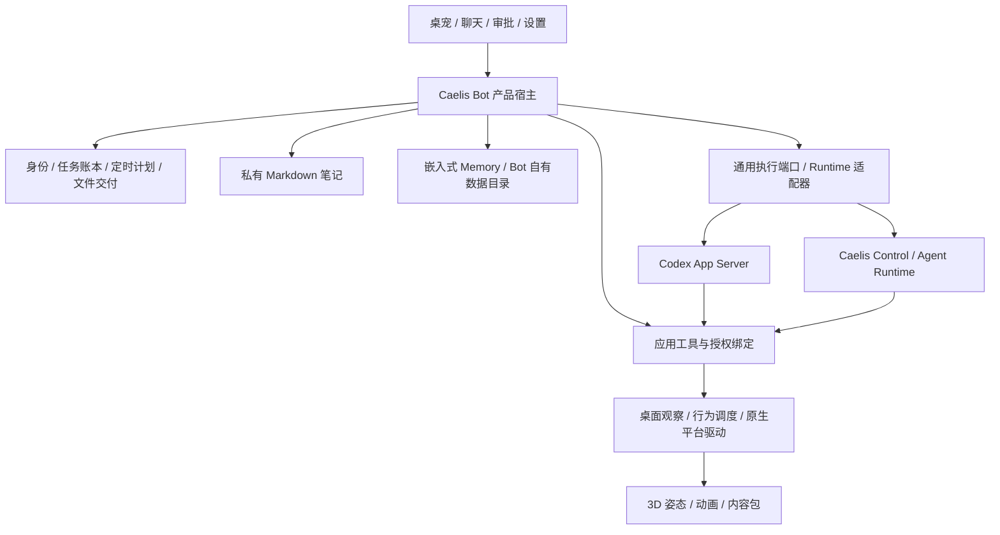

# Bot 产品宿主与 Runtime 扩展规划

日期：2026-09-23。状态：**产品层基础已实现；完整闭环仍在实施**。

本提案按本轮用户决定调整职责归属。身份、工具、任务目录/账本/报告和提醒已由本应用持有；
Codex 已适配，Caelis 通用协议已完成 [隔离 Host 联调](caelis-application-acceptance.md)，真实模型待验。Notebook/Memory 首片已实现，见[个人空间](personal-memory.md)；完整文件交付与新调度模型仍是目标。
现有实现见 [architecture.md](architecture.md)，不能将本文整体作为已发布功能。
它取代上一轮可用性建议中“个人记忆可后置”及继续扩充 Caelis 专用 Bot 接口的方向。

## 1. 核心决定

**Caelis Bot 持有助手产品；Caelis/Codex 提供执行能力；Memory 提供可嵌入的记忆引擎。**

Bot 身份、角色、私人笔记、记忆范围、任务协调、提醒和交付不依赖某个 Runtime 的 Bot 模式。
Caelis 不需要为了支持桌面助手继续扩充专用 Bot 产品。其终端 Bot 入口和专用产品路径可直接移除，不要求 Bot Mode 兼容；
普通 CLI、模型连接、Control Host、Session、审批和工作区 Memory 保持独立可用。

这是职责迁移，不是让 Bot 再实现一套 Agent 执行循环、原生审批或原生会话存储。
采用 App Server 式通用执行接口，由应用接入自己的工具和上下文。
OpenAI 的公开设计也将 UI、应用上下文和应用工具交给宿主，执行、事件和审批交给 harness。
参见 [Codex as a platform](https://developers.openai.com/blog/codex-as-a-platform)。



图中的工具回调是受限调用，不代表 Runtime 可以读取整个 Bot 数据目录。
逻辑模块先保留在同一个 Go 应用中，不新增独立服务或必须安装的 Memory 进程。

| 责任 | 唯一所有者 | 边界 |
| --- | --- | --- |
| 助手身份、角色策略、个人资料范围 | Bot | 换角色、换模型、切换 Runtime、结束工作不重建身份 |
| 笔记内容、记忆采集与使用策略 | Bot | Memory 负责其内部证据、事实、检索与治理；Core 不规定助手记什么 |
| 任务目标、独立工作目录、材料分发、完成汇报 | Bot | Runtime 负责实际执行及其规范状态 |
| 定时计划、到期激活、重叠与错过策略 | Bot | 到期后调用通用执行接口；Agent 不理解 cron |
| 模型调用、原生 Session/Turn/工具执行、审批与历史 | Runtime | Bot 保存绑定与呈现，不伪造 native 完成、授权或历史 |
| 模型配置、登录、凭据 | 各 Runtime | Bot 提供管理入口，不复制、持有或跨 Runtime 同步凭据 |
| 上传材料、成果登记、打开与另存为 | Bot + Runtime 通用文件接口 | Bot 管交付体验，Runtime 管执行侧访问边界 |
| 屏幕上下文、桌宠位置、外部操作 | Bot 原生平台层 | Renderer 不获得 OS 权限；动画不形成审批 |
| 外观、动作资源、姿态适配 | 内容包与 renderer | 预置资源和第三方包导入；内容包不携带可执行插件代码 |

## 2. 现状与需要收敛的位置

本轮核对 Bot 基线 `8db8611`、Caelis 开发树 `bd1f61c7`、Memory `v0.6.1` 公开接口。
这是源代码评估；没有在本轮重新运行模型、安装 Runtime 或完成兼容发行验收。

- Codex 路径已有应用侧 Bot MCP、任务工作目录、提醒调度和有限完成汇报。
  任务产品规则与 native thread/turn 操作目前一起放在 `internal/backend/codex/tasks.go`。
- Caelis 路径通过 `api.ControlCompanion` 使用专用 Bot/受管工作/提醒授权接口，
  当前 `internal/app/app.go` 因此跳过本地 Bot 工具和调度的组装。
- Caelis 已有通用 Session 操作、审批、恢复及不以工作区名称作为身份的 Memory binding。
  但不能把现有 CreateSession 的 metadata 当作完整、受信的应用会话配置和工具注入协议。
- Memory 已有公开的 Go 嵌入接口、Remember/Recall、事实读取和治理能力。
  **当前 Caelis Bot 已嵌入 Memory v0.6.1；Notebook 是独立的普通 Markdown 目录。**
- 基础桌面几何、本地行为与角色动作已存在；通用语义动作回执、组件级观察和外部操作尚不完整。

目标是消除“两套 Runtime 对 Bot 产品各实现一次”的分叉：任务协调从 adapter 上移；
adapter 保留 native ID、协议投影、审批路由和恢复事实。现有安全边界随迁移保留，不能一起删掉。

## 3. 产品宿主和应用工具

建议新增的模块落点均位于本仓库，以下目录名是规划，不表示已经创建。

| 模块落点 | 持有内容 | 不持有内容 |
| --- | --- | --- |
| `internal/bot` | 身份、秘书上下文、按需激活、有限结果汇报 | 模型推理循环 |
| `internal/toolhost` | 工具目录、会话绑定、调用回执和应用侧授权 | 全局修改 Runtime 的 MCP/技能配置 |
| `internal/tasks` | 工作意图、输入材料、工作目录、native 绑定、成果关联 | 第二份权威 native transcript |
| `internal/notebook`、`internal/botmemory` | 笔记和 Memory 宿主策略 | 直接读写 Memory 数据库内部表 |
| `internal/automation` | 计划、到期记录、执行与送达对账 | Caelis 专用 Bot endpoint |
| `internal/artifacts` | 输入副本、产物快照、文件句柄与交付 | 对任意路径的隐式访问权 |
| `internal/backend/api` 与各 adapter | 通用执行、工具绑定、文件与恢复端口 | 人设、提醒产品语义、笔记目录布局 |
| `internal/desktop` 与角色 renderer | 原生观察/移动/交互、动画 | 依据模型正文推断任务成功或用户授权 |

不把所有方法塞进一个 `Engine`，沿用小型可选能力接口。详细语义见
[Runtime 扩展契约提案](runtime-extension-contract.md)。Caelis 与 Codex 可以采用不同的工具传输，
但 Bot 工具的业务实现只保留一份。

秘书工具包括任务委派/查询/继续/停止、笔记读写、记住/回忆、提醒管理、材料/成果引用和桌面动作。
模型不直接操作任务账本、Memory SQLite 或用户凭据。专业 worker 默认只接收完成任务所需的材料、
相关上下文摘要、受限目录及成果登记能力，不继承完整笔记、个人 Memory、提醒管理或桌宠控制权。

产品角色明确“专业工作通过独立任务完成”。用户说“帮我分析这个文件”已授权这种内部组织方式，
无需再要求用户复述“开新会话”。但创建工作、调用 shell、网络访问和修改外部文件是不同授权：
自动审批只覆盖明确列出的应用内操作，不能借工作委派绕过 Runtime 的执行策略。
原始用户请求与秘书生成的任务说明分开传递，后者不能伪装成新增用户授权。

工具调用必须绑定可信的应用实例、执行会话、当前激活、工具版本和 native 调用 ID。
这些字段由宿主/协议提供，不能让模型在参数中选择。现有私有 MCP 仍需补齐调用归属证据，
不能仅凭“来自本机”或“工具名以 bot 开头”开放整个个人空间。

## 4. 长期记忆：Bot 的持续性基础

### 4.1 长 Session、recall/remember 与一本 Notebook

2026-09-23 最新收敛：普通 Markdown 目录，只有系统生成的 `INDEX.md`、持续精炼的
`MEMORY.md` 和 `YYYY/MM/DD/` 日期笔记。用户直接编辑，Bot 用 Runtime 文件工具读写，
不新增笔记 CRUD/UI、SOUL/USER 文件、身份快照或后台整理 Agent。UI 仅首次初始化提供必填名字和可选描述，
通过可见的普通用户消息让 Bot 更新 MEMORY.md，不另存配置。Bot 保留读写笔记的习惯，长 Session 通过 Compact
延续工作上下文；完整规则和当前差距见[个人空间](personal-memory.md)。

| 数据 | 保存什么 | 权威与修改方式 |
| --- | --- | --- |
| Notebook | 核心认知、偏好与按日期保存的具体笔记 | 普通 Markdown 为正文真源；用户直接编辑、Bot 用文件工具编辑；INDEX 由系统生成 |
| Memory | recall/remember 保存和查找的有来源线索 | 使用 Memory 公开 API；双方可更正、遗忘；不另持有一份可独立修改的用户画像 |
| 产品账本 | 工作进度、提醒、授权、交付状态、未知执行结果 | 结构化原生状态；模型不能通过写笔记将任务标为完成 |

不自动将每次笔记修改同步成另一份不可追踪的“记忆真相”。首版使用文件列表、读取和文本搜索；
Notebook 不依赖 Memory 摄取才能工作。以后如增加 Memory 或 embedding 全文索引，
索引必须可重建，并处理源笔记修改/删除；不能产生两个独立正文所有者。

### 4.2 个人资料共享，执行绑定隔离

Bot 拥有稳定 `BotID`，Runtime 原生 Session 只是可更换的执行绑定。Memory 的作用域使用应用分配的
`MemoryScopeID`，不以 worker CWD、native Session ID 或角色资源 ID 充当个人身份。

根据用户本轮补充，**同一个 Bot 默认共享个人资料、Notebook 和长期 Memory，不按 Runtime 分库。**
选择 Caelis 或 Codex 是选择执行后端；切换后仍能记得用户偏好、长期目标和已经保留的资料。
无需复制两份记忆，也不需要让两个 Runtime 相互同步。若未来支持多个用户/助手，其身份范围
可以隔离，但 `RuntimeProfileID` 不作为个人记忆的分区键。

原生会话历史、登录凭据、模型配置、权限和在途执行仍按 Runtime 隔离。
Bot 维护统一产品任务账本，每项工作记录自己的 Runtime/native 绑定；旧工作留在原后端继续或恢复，
不会因切换而被自动重建。共享记忆也不意味着共享旧后端的授权。

切换后由 Bot 向当前 Runtime 按需提供同一份个人资料和相关记忆，必要时附带有来源的接续摘要，
不搬运整段原生执行历史或全部私人资料。用户可读历史继续保留来源；“记忆连续”与“原生会话搬家”
是不同能力。工作进度来自任务账本，不由摘要猜测。换模型、创建工作、归档任务或重启均不改变记忆身份。

示意布局（迁移时解析真实平台数据目录，不硬编码路径）：

```text
BotData/
  identity.json
  Notebook/                # INDEX.md、MEMORY.md、YYYY/MM/DD/；普通 Markdown
  personal/memory/          # 同一个 Bot 的记忆，由嵌入的 Memory 独占管理
  product-state/            # 统一任务、计划、调用和送达账本
  inbox/ + artifacts/       # 受控材料和产物快照
  work/<task>/              # 单项专业工作的执行目录
  runtimes/<opaque-profile>/
    bindings/               # 各 Runtime 的连接配置与 native 绑定，不含凭据
```

整棵 `BotData` 不作为模型工作区。秘书经 Runtime 文件工具访问 Notebook；worker 只获得自己的 `work/<task>`。
应用层的所有权和目录划分不等于 OS 级强隔离，实际模型文件访问仍要由各 Runtime 的沙箱和能力落实。
不能宣称仅靠目录命名防止越权。

### 4.3 复用 Memory，不复用 Caelis 的 Memory 数据库

由 Bot 使用发布版本的 `appliance` 和 `sdk/go/memory`，创建自己的数据目录和能力授权。
本轮核对的 `v0.6.1` 已有嵌入接口、词法检索、事实读取、证据提交及遗忘治理；
不需要为 Bot 增加向量数据库、Memory 守护进程或模型凭据。

`MemoryScopeID` 到 Space、精确 LabelSet、Identity/View/Grant 的映射由 Bot 宿主维护，
工具调用只取得该范围的能力和检索预算。模型不能自由传入这些权限字段，worker 也不继承
秘书的 Memory capability；需要的信息通过受限上下文包交付。Caelis 普通会话的工作区
Memory 与这套存储并行存在，不混库、不自动搜索彼此的数据。

首版采用无需模型的基础检索。笔记整理由 Bot 在正常工作中完成，不增加独立维护 Agent、
后台模型轮询、第二份 API Key 或 Caelis 专用产品接口。维护能力双方一致，来源仍需如实记录，
不能把模型推断自动升级为“用户已确认”。

Memory 的 `Recall` 返回证据，不保证每条都是当前有效偏好，使用时需核对对应笔记和来源。
历史线索保留时间及被替代状态。独立 Facts 资料页已退出，旧内容一次性复制到 Notebook 并保留原件，避免长期双写；MEMORY.md 是普通可编辑正文。

### 4.4 使用路径

1. 固定说明保留笔记位置与读写习惯；UI 名字/描述经用户消息写入 MEMORY。新上下文或 Compact 后
   缺少认知时读 MEMORY.md；已有足够上下文时无需每轮重读，也不生成独立画像快照。
2. 需要旧事时查 INDEX、读取日期笔记或 recall；普通文件结果追加到上下文，不重写已发送前缀。
3. 过程及时写入当天目录，稳定认知精炼到 MEMORY.md，长细节留在日期笔记；
   宿主在启动、激活前及本轮结束后重新生成目录，不覆盖核心记忆或日常正文。
4. 委派只提供该工作需要的摘录。结果返回后按价值整理笔记，执行回执仍以产品账本为准。
5. 用户用任意编辑器管理 Markdown，也可以在聊天中交给 Bot 完成；不依赖专用笔记管理 UI。

不持续扫描屏幕、导入全部聊天或空跑模型来制造“人格”。长期性来自可靠的身份、资料和承诺，
角色表情不作为情绪或记忆真实性的证据。

“忘记”必须调用 Memory 的治理入口并同步处理由 Bot 管理的源引用/再导入记录，防止后台重新灌入。
Notebook 删除、Memory 遗忘、聊天历史删除分别说明；不能宣称已删除 Runtime 历史或外部备份。
已发送给活跃执行上下文的内容不能靠数据库删除收回：用户要求不再使用时，应停止或在显式上下文
重建边界移除并报告处理范围。Memory 不可用时提示未保存，不输出虚假的“记住了”。

共享 Memory 由单一 Bot 宿主管理写入；来源记录保留 Runtime、native turn/call 和用户消息引用，
这些是审计与去重信息，不是记忆分区。Notebook 编辑前读取最新文件并优先局部修改；
首版不承诺外部编辑器和 Runtime 文件工具之间的跨进程事务锁。线索更正通过 Memory 治理接口。
旧任务迟到的总结不能覆盖后来明确纠正的笔记。切换后按需重新读取当前笔记，
不得复用已撤回的旧缓存。备份/恢复需覆盖 Bot 来源账本和 Memory 的一致边界，避免恢复后重新采集
已遗忘内容或重复执行旧工具；不能单独替换内部 SQLite 文件。

## 5. 角色身体与桌面操作

采用四层：**观察 → 语义意图 → 本地行为调度/原生放置 → renderer 动作**。
模型表达“看向结果窗口”“走到这里”，不逐帧控制坐标，不通过连续 LLM 调用维持待机。

| 层次 | 能力 | 本轮建议 |
| --- | --- | --- |
| 情境表达 | 注视、转身、姿态、庆祝、递交结果的表现 | 纳入首版；提高辨识度，补语义状态与动作回执 |
| 桌面移动 | 在允许区域靠近锚点、返回原位、避开输入 | 首版完成边界与小范围闭环；无相应资产时明确降级 |
| 组件观察 | 指定应用/窗口的 AX 元素、选中内容或截图 | 保留端口，后续独立适配与权限验收 |
| 外部操作 | 点击控件、输入、拖动等真实应用行为 | 后续单独能力；不可由播放动画顺带触发 |

`DesktopObserver` 给出有来源、revision、有效期的显示器/Space/窗口/指针快照。
`ElementInspector` 以后按需要读取组件；窗口标题、组件文本与截图是不同数据范围，分别授权。
观察到的文字属于外部内容，不能提升为用户指令或操作权限。

`PresenceDirector` 在本地安排动作、冷却和优先级：用户拖动/输入高于 Agent 动作，高于待机。
Agent 意图有超时、取消和回执：accepted、started、completed、interrupted、suppressed、
unsupported、failed。completed 只证明对应动作已完成，不证明任务成功或外部应用已接受操作。
隐藏角色或开启减少动态效果时按能力降级，不为了完成动作强行显示或抢焦点。

原生层负责屏幕逻辑坐标、混合 DPI、窗口层级和命中区域；renderer 只负责角色坐标内的姿态/步态。
移动原生 pet window 与命中区域必须一致。窗口锚点包含进程实例和新鲜度，不能仅缓存窗口 ID；
真正操作前再次验证目标。当前前台窗口也不能被默认为某项任务所属窗口。

外部操作以后走独立 `ExternalActionExecutor`：OS 权限、应用侧用户授权和 Runtime 工具策略共同约束，
优先语义控件操作；坐标回退需要刷新目标。角色碰到某按钮不等于点击，允许看屏幕不等于允许操作。

内容包以后可以声明 gaze/pose/locomotion 等能力与 fallback，宿主按版本协商。
当前 GLB/PNG 内容包保持数据包，不加入任意 JavaScript、原生二进制或工具授权。
Windows 后续实现同一观察/放置/交互端口及自己的权限模型；本次不实施 Windows。

## 6. 文件输入与成果交付

Bot 持有统一 `ArtifactStore`：输入与输出用不透明句柄关联，不要求模型拼接真实用户路径。

1. 用户选文件/拖入，原生层按 Runtime 协商的类型、数量、大小预检，保存不可变材料副本及摘要。
2. 用户请求与材料授权一起绑定到目标任务；执行侧通过明确允许的目录挂载/复制或通用文件接口取得。
   不能直接翻 Caelis Store、猜 worker 路径或因同机运行就假定可读。
3. worker 通过受限产物登记接口提交成果。宿主验证归属、路径边界、大小/类型并生成稳定快照，
   拒绝符号链接逃逸和复制过程中发生变化的文件；模型正文中的任意路径不是下载授权。
4. 任务结果包含结构化成果列表。聊天中直接预览、打开、另存为；重启后仍可找到，并能引用继续修改。
5. 另存到外部位置由用户明确选择；模型主动改写外部项目仍保留 Runtime 审批，不借“导出”绕开。

文件字节运输不等于模型理解其格式。图片、文本、PDF、表格按实际读取/处理能力展示，
没有解析器时让具备相应工具的 worker 处理或提前解释限制。角色内容包和聊天材料分开校验与存储。

## 7. 定时任务是 Bot 承诺的持久化

区分 `Schedule`（规则）→ `Occurrence`（某次到期）→ native execution（执行）→ delivery（送达）。
应用先持久化到期记录再派发，使用计划版本和到期时间形成稳定去重键；断线后按原操作 ID 对账，
未知结果不自动创建第二次执行。完成汇报和通知同样记录独立回执。

计划保存时区、下一次时间、允许的目标/材料、固定 Runtime profile、重叠/错过策略和授权版本。
定时授权只能覆盖原定目标，不将历史助手文字当作新的用户许可。到期派发前检查是否已暂停/撤销；
正在执行的工作需要单独停止。重复计划默认不重叠，睡眠错过的同类提醒合并或明确跳过。

纯时间提醒不需要模型；需要处理资料/执行工作的计划才唤醒相应 Runtime。
首版不因提醒到期静默切换用户 Runtime，未就绪的目标显示等待连接或失败，不能偷偷换模型服务。
明确退出应用暂停调度；隐藏角色、收起聊天不暂停。用户可直接查看、暂停、取消，不必靠模型理解。
未来如要退出后仍运行，由 Bot 自己提供可选后台服务，不能把 Bot 产品调度重新塞回 Caelis Core。

## 8. 替换与数据边界

1. 用户已明确授权删除 Caelis 旧 Bot Mode，不要求旧 API、TUI、工具或数据迁移兼容。
   普通 CLI/TUI、模型登录、Control 会话、审批与 Workspace Memory 必须保留。
2. Bot 先抽出 Codex 的产品任务、工具和调度，同一应用层再消费 Caelis 通用能力。
   保持原生审批目标、沙箱上限和未知结果语义，不新建一套模型执行循环。
3. 桌面装配已禁止调用旧 Caelis Bot Mode；新协议按能力协商启用，缺少能力时保留设置入口。
   不偷偷创建旧 Bot、复制旧计划、切换 Codex 或修改 Caelis 用户数据。
4. 现有 Codex 任务绑定继续使用，产品账本一次性接收其句柄/报告回执；重复请求不再建工作，
   不重复报告。共享身份和提醒保存在 Bot 自己的目录，提醒与在途工作继续绑定来源 Runtime。
5. 不要求迁移旧 Caelis Bot 笔记和工作，也不直接解析其数据库。旧数据保留；后续若提供导入，
   独立设计用户授权和公开导出能力。删除代码不等于授权删除用户的实际资料或凭据。

Core 交接与审计标准见 [Caelis 重构 Prompt](caelis-core-rebuild-handoff.md)。
本仓库旧 adapter/protocol fixture 暂留作为替换参考，不是桌面兼容承诺；接入新协议时清理。
仅下掉终端入口、继续让 Bot 依赖专用 Control Bot 接口，不算职责收敛完成。

## 9. 可独立提交的实施切片

每片内可按契约、实现、真实联调继续拆 commit。B 的产品层基础已实现，Caelis 隔离 Host 联调已完成，真实模型与其他完整验收仍待办，不表示已具备发布资格。

| 顺序 / 建议提交主题 | 仓库与落点 | 交付与验收 | 依赖 |
| --- | --- | --- | --- |
| A `feat: support scoped application sessions and tools` | Caelis `control/appserver`、`app/gatewayapp`；本仓库契约 | 通用会话配置、工具绑定、调用归属、恢复查询；用不含 Bot 逻辑的最小客户端通过授权/断线/恢复测试 | 无；下一次 Caelis release 的基础 |
| B `refactor: centralize bot task and tool ownership` | Bot `internal/bot`、`internal/tasks`、两套 adapter | 同一套任务工具驱动两个 Runtime；两项并行、一个审批、精确停止、重启对账；Codex 原路径不退化 | A 对 Caelis；Codex 抽取可先做 |
| C `feat: add private notebook and personal memory` | Bot 拟新增 `notebook`/`botmemory`、设置/聊天入口；pin Memory 公共模块 | 两套 Runtime 均能记住、回忆、更正、忘记；切换 Runtime/跨工作/重启持续；凭据与授权不串用；worker 最小上下文 | B 的工具绑定；笔记存储可先做 |
| D `feat: deliver task materials and artifacts` | Bot 拟新增 `artifacts`、`api/tasks.go`、原生文件 UI；Caelis 通用文件能力 | 提供真实文件→工作→打开/另存为→重启找回→继续修改；越界/失效/不支持类型明确失败 | A/B；Core 文件能力可与 A 分开提交 |
| E `feat: reconcile resident schedules and deliveries` | Bot 拟新增 `automation`、任务账本、通知/提醒入口 | 暂停/取消、睡眠补偿、同次到期去重、断线未知不重发；固定 Runtime profile；无模型纯提醒 | B；需材料的计划依赖 D |
| F `feat: add semantic pet actions and receipts` | Bot `internal/desktop`、角色 renderer、内容包能力契约 | 情境注视/转身/可用的短距离移动；动作回执；用户拖动打断；隐藏/减少动态效果降级 | 可独立；缺移动资产时不宣传移动完成 |
| G `refactor: retire legacy caelis bot ownership` | Caelis Bot TUI 与专用产品路径；Bot 旧 adapter 清理 | 旧 Bot Mode 清晰退出、无兼容分支；普通数据保留；普通 Caelis 回归不变 | A；与 B 并行推进 |

**本次 Bot release 核心范围：A–E 的完整闭环、F 的可用表达与协议、G 的旧产品路径清理。**
组件级观察、通用 Computer Use、退出后常驻服务、自动人格学习、Windows 原生发行分别后续推进。
不以这些扩展阻挡首版，也不把长期记忆继续笼统推到以后。

发布验收至少包括：两套真实发行 Runtime 的干净接入；私人笔记与记忆连续性；文件成果交付；
并行工作和必要审批；跨重启/睡眠的计划恢复；原生角色交互与一整天常驻观察。
记忆验收必须实际经过“Codex 记住偏好 → 切到 Caelis 正确回忆 → 更正 → 切回 Codex 使用新值 →
忘记并重启后不再召回”，同时确认没有复用任何登录凭据或旧执行授权。
协议 fixture、编译通过和一次“你好”均不能替代这些验收。失败时保留能力禁用和可恢复状态，
不能把“安装成功”当作“完整能力就绪”。

## 10. 联调资料

本仓库公开规划入口为本文与 [通用 Runtime 扩展提案](runtime-extension-contract.md)。
当前行为对照使用 [backend-contract.md](backend-contract.md)、[caelis-integration.md](caelis-integration.md)、
[task-delegation.md](task-delegation.md)、[desktop-behavior.md](desktop-behavior.md)、
[character-assets.md](character-assets.md)、[platform-baseline.md](platform-baseline.md)。

跨仓库核对点（目录相对于各自仓库，不是 Bot 构建依赖）：

- Caelis：`control/appserver/session_client.go`、`configuration_client.go`、`command.go`、
  `control/memorybinding/binding.go`；迁移对照 `docs/bot.md`、`docs/bot-backend.md`、
  `app/gatewayapp/bot_runtime.go`、`control/bot/files.go`。
- Memory：`appliance/runtime.go`、`appliance/facts.go`、`sdk/go/memory/client.go`、
  `docs/memory-v0.6-facts.md`；以发布的公共包接入，禁止私有 sibling import。
