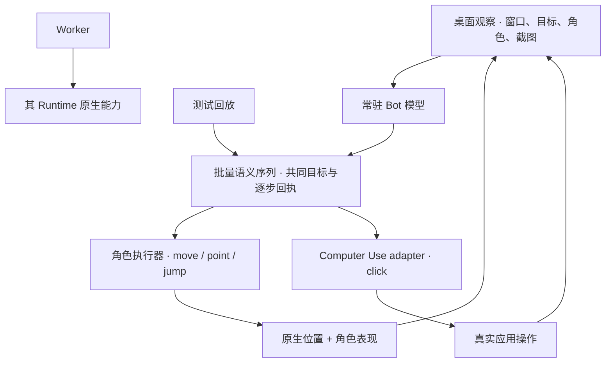

# Bot Control 与 Computer Use 规划

2026-09-28。状态：**探索性 POC，第一片真实 Cua Driver 验证已开始，不承诺全部转为正式功能**。
相关协议：[通用控制与角色响应](bot-action-protocol-v1.md)、
[资产交接](bot-action-assets-handoff-v1.md)、[系统虚拟手柄](virtual-gamepad-research.md)。
最新范围以 [POC MVP](bot-control-delivery-plan.md)为准：模型观察、批量语义动作和一项真实 Computer Use 联动前移；
人工控制产品模式、通用资产格式与系统手柄后置。本文保留更广的组件研究，不作为全部实施清单。

## 1. 决策与边界

Bot Control 放在 Bot 产品宿主，模型工具只授予常驻 Bot；测试回放用于独立验证执行器。
模型提交 move/point 等简单语义动作的短序列，宿主执行细节；实体手柄不是模型接口的前提。
Computer Use 是可替换、跨平台的执行能力，最小真实操作进入 POC 闭环，
不做成 Caelis 专用私有能力，也不另外引入一套 Agent 推理循环。
Codex/Caelis 保持原生推理、工具调用、审批和历史，宿主提供同一产品控制契约。

Worker 保持各自 Runtime 的原生能力范围：不注入 Bot Control 工具、绑定、凭据、专用 skill 或手柄租约。
Runtime 原生拥有的电脑/浏览器工具也不在本规划中删除或改造。
Worker 的工作报告不自动取得 Bot 控制权；常驻 Bot 只能在原用户授权范围内决定后续行动，
不能把 Worker 文本当成新的授权或隐式转发到宿主执行。

统一的是上下文、控制来源、用户停止和真实回执；身体表现、外部应用操作和系统手柄仍是不同执行范围。
角色数据不能经动作完成事件升级成系统操作。模型不感知角色技能或动画目录。

## 2. 建议代码责任

以下是目标责任边界；首片暂集中于 `internal/desktopcontrol` 与独立 `experiments/desktop-control`，
不在 POC 阶段提前搭建完整框架：

| 位置 | 责任 |
| --- | --- |
| `internal/botcontrol` | 实验语义协议、批量顺序、目标/来源、停止和回执；模型入口只认常驻 Bot |
| 物理输入适配器，后置 | 可选人工控制，不作为本次 POC 产品目标 |
| `internal/computeruse` | 不依赖 Runtime 的观察/操作契约，以及 Cua 等驱动适配 |
| 独立 gamepad adapter | 归一化状态到系统设备的转换、设备生命周期；复用开源实现 |
| `internal/desktop` 与平台 driver | 原生权限、显示器/窗口、输入接管、Bot 身体位置及本机资源 |
| `frontend/src/character` | 最小动作适配、动画混合、真实运动反馈；正式 profile/schema 后置 |
| `internal/backend/*` | Codex/Caelis wire 投影、多模态工具结果、原生调用与审批身份 |

不从兄弟仓库私有导入。用公开协议和内部稳定 port；接第三方驱动优先宿主持有的独立子进程或窄 SDK，
不直接暴露全功能 MCP 服务让任何 Worker 都能连接。

## 3. 后续模型接入的依赖与历史缺口

这些依赖按 POC 观察/执行所需范围处理，Bot 侧仍需独立验证；Core 实现已由 #82 承接。

- Bot 内部 `api.ToolResult` 已增加 structuredContent；文本/图片经 content-v1 投影，现有文本工具兼容。
  当前 `[]map[string]string` 仍非完整标准内容 union，复杂资源类型后置，不宣称已全量支持。
- Bot 本地桥接有 10 秒连接 deadline 与 512 KiB 响应上限。大图不能靠无上限 base64 绕过；
  要明确缩放/编码/受控资源读取，以及取消、超时后 unknown 的恢复路径。
- 现有 bot_gesture 仅 attention/nod/celebrate，隐藏时可无可见播放即返回。
  新控制回执必须区分接受、实际响应、被压制；兼容旧工具不能冒充新能力。
- Caelis 应用 callback 延续绑定、claim、取消与未知结果保护；多模态映射缺口已由合并的 #82 解决。
- Bot MCP 本地调用还需对不可伪造的 resident 来源、激活与 native call 做闭环；
  不能只靠模型传一个 sessionId 或工具名字判断权限。

核心依赖已单独提交 [Caelis #81：应用工具回调支持标准多模态结果与受控媒体资源](https://github.com/caelis-labs/caelis/issues/81)。
该需求已在 [PR #82](https://github.com/caelis-labs/caelis/pull/82) 实现；
2026-09-28 已确认合并，公开 schema/wire 固定在 `369cd58b6d26cfd43057e0393fcab7d7c2c84cd8`。
本轮未重复 Core Review；Bot 另以真实 Host 与合成 provider 验证能力门控、组件反馈和图片内容块。
Issue 聚焦通用 Runtime 契约，不要求 Core 实现桌面驱动或角色协议。
推荐标准参照 [MCP ContentBlock/structuredContent](https://modelcontextprotocol.io/specification/2025-06-18/server/tools)
和 [ACP 内容块](https://agentclientprotocol.com/protocol/content)；协议字段可复用，授权仍归宿主和 Runtime。
上游 capability 宣告完成前不将 JSON 中的图片字段视为模型已经看见图片。

## 4. Computer Use 的公共契约

观察结果含 snapshot ID、捕获时间、来源、显示器/窗口/元素不透明引用、可用性、图像与可选结构化内容。
窗口标题、AX/DOM、OCR 和截图是外部数据，不形成控制授权。
能用结构化元素/浏览器定位时优先使用；截图坐标回退绑定到同一观察版本，不能在移动后的旧屏幕上继续点击。

操作含原调用身份、目标引用/版本、类型、参数、有效期和原 request ID。
结果区分 accepted、dispatched、observed、failed、unknown；输入投递成功不保证应用效果。
超时只停止继续派发，不把可能已发生的点击/输入标成“未执行”；先查原回执/重新观察，再决定是否继续。

整个宿主有一个前台输入占用通道，避免多个常驻激活同时操作键鼠；外部手柄与依赖前台的键鼠共用冲突仲裁。
背景操作仅对已验证支持的驱动能力开放，不宣称所有平台都能无焦点操作。
用户接管优先并中断后续步骤；停止必须释放自有按键/指针/手柄状态，不能取消用户自己的物理输入。
审批基于真实操作与目标，不根据角色点头、动画或工具描述放行。沿用现有明确列表策略，不整体自动批准第三方 MCP。

## 5. macOS 与 Windows 现在共同设计

后端和 OS 是独立维度：Codex/Caelis × macOS/Windows，按各能力单独协商和验收。
Windows 已进入近期规划，本轮先固定协议与适配边界，不声称原生宿主或安装包已实现。Linux 不在当前计划。

| 共同契约 | macOS 适配 | Windows 适配 |
| --- | --- | --- |
| 图像观察 | ScreenCaptureKit/驱动能力，按系统版本门控 | Windows.Graphics.Capture/驱动能力，检查可用性 |
| 结构化 UI | Accessibility | UI Automation |
| 键鼠输入 | 平台驱动/系统事件 | 平台驱动/SendInput；遵守完整性级别边界 |
| 桌面布局 | Display、工作区、Dock、Spaces | Display、工作区、Taskbar、虚拟桌面 |
| 本地进程/IPC | 当前 Unix socket/进程组路径 | 独立受限 IPC、ACL、进程树回收实现 |
| 系统手柄 | 单独验证 entitlement 与游戏消费者 | 单独验证驱动安装、XInput/HID/GameInput 消费者 |

共同模型使用 systemBar/workArea 等概念；Dock 不成为协议必需类型。
逻辑桌面点、每窗口点、截图像素、角色局部坐标各自命名。观察携带缩放、旋转、裁剪与变换；
混合 DPI、负坐标、显示器拔插、窗口代次变化后失效旧引用，不能直接复用 macOS 点值或 HWND。

当前 macOS deployment target 12.0 不证明 Computer Use 候选支持 12.0，也不证明所有能力支持 Intel。
新能力分别设最低系统版本。Windows 原生与 WSL 分开，不能拿共享 Go 编译代替原生启动/权限/输入验收。
Microsoft 文档明确 [SendInput](https://learn.microsoft.com/en-us/windows/win32/api/winuser/nf-winuser-sendinput) 的完整性限制；
[UI Automation](https://learn.microsoft.com/en-us/windows/win32/winauto/entry-uiauto-win32)、
[屏幕采集](https://learn.microsoft.com/en-us/windows/apps/develop/media-authoring-processing/screen-capture)
分别是结构化 UI 和图像路径，不能互相推导支持范围。

## 6. 开源复用结论

以下记录选型调研；Cua 0.30.2 的首轮范围与实测另见 [验证记录](bot-control-poc-validation.md)，其他候选仍未经 Bot 验证。

| 候选 | 合适层次 | 建议 |
| --- | --- | --- |
| SDL3，zlib | 后置的实体手柄输入 | 不进入本次最小 POC 依赖 |
| Cua Driver，顶层 MIT、原生/绑定含 MPL-2.0 | 跨平台观察与操作底座，宿主持有进程/IPC | 固定 0.30.2 完成首轮 macOS 实测；分发许可与 Windows 分别验收 |
| Peekaboo，MIT | macOS 原生 UI 自动化库 | Cua 不满足某项能力时评估；取自动化组件，不引入其 AgentRuntime |
| Playwright MCP，Apache-2.0 | 浏览器结构化观察/操作 | 可选专门接收端，不代替原生桌面控制 |
| UI-TARS Desktop，Apache-2.0 | 完整 Agent 产品和演示 | 参考交互/测试方法，不增加第二个模型循环 |
| 系统手柄候选 | 虚拟设备与控制报告 | 单独评估，见手柄调研；不由 Cua 键鼠能力推断支持 |

Cua 文档支持宿主私有驱动进程，但 Windows 前台/会话、浏览器类型、后台操作及最低 OS 有限制；
按 [集成选择](https://cua.ai/docs/concepts/choose-a-cua-driver-integration)、
[进程模型](https://cua.ai/docs/reference/cua-driver/process-model)、
[能力限制](https://cua.ai/docs/reference/cua-driver/limits) 验证。锁定版本及传递依赖，核对遥测、网络与授权默认值。
[Peekaboo 架构](https://github.com/openclaw/Peekaboo/blob/main/docs/ARCHITECTURE.md)、
[平台支持](https://github.com/openclaw/Peekaboo/blob/main/docs/platform-support.md)、
[Playwright MCP](https://github.com/microsoft/playwright-mcp) 和
[UI-TARS Desktop](https://github.com/bytedance/UI-TARS-desktop) 为其各自一手来源。

优先宽松且完整许可明确的成熟组件；核对固定版本的依赖/数据许可和再分发，source-available 或付费 broker 不当作默认开源方案。
复用现成观察、定位与输入原语；只自建产品来源、路由、租约、角色协议和回执适配。
如果候选不满足，先记录失败的具体能力/平台/许可证约束，再针对缺口自研，不直接重写整个自动化栈。

## 7. 顺序与完成标准

1. POC-1：真实 Cua Driver 的组件语义/状态/动作引用/坐标为主，截图辅助；先验证可逆操作和读回，再补模型自主定位证据。
2. POC-2：有限语义序列与真实身体位移/指向，使用现有角色，尽早验证模型控制。
3. POC-3：在同一目标上联动一项真实 Computer Use 操作，重观察效果。
4. POC-4：重复和扰动实验，比较角色参与的价值，决定继续、收缩或停止。
5. 验证后再决定正式 schema、资产导入、跨平台覆盖、人工控制或系统手柄等独立 feature。

具体切片、完成证据和依赖排除见 [交付计划](bot-control-delivery-plan.md)，本页不另维护一套阶段编号。

Core Issue 已在前轮提交；本轮实现默认关闭的驱动首片，未改角色资产、系统权限或生产 npm 依赖。
英文 skill 只在实验工具可用时引导结构化观察与有限操作；代码检查及联调结果见
[验证记录](bot-control-poc-validation.md)。Codex 的新语义工具完整原生模型路径另行验证。
