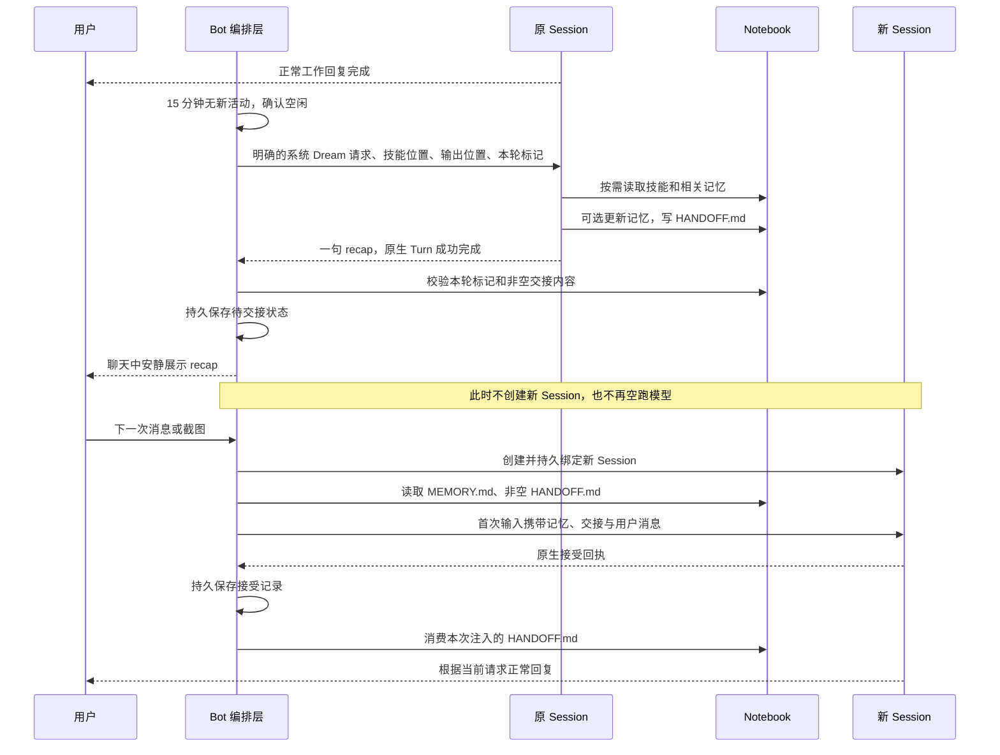

# Bot Dream：空闲整理与延迟交接

2026-09-28，已实现，尚未发布。Provider 原生 Compact 不调用、不修改、不接管。

## 产品行为

Bot 主对话结束后，连续 15 分钟没有新活动，宿主在原 Session 中发起一次 Dream。
Bot 按需读取 `caelis-dream`，有限整理记忆，在指定的可写位置生成 `Notebook/HANDOFF.md`，
以一句简短 recap 结束。聊天中保留 recap，整理过程不展示，不主动弹结果通知；原生审批和错误仍可见。

整理成功只标记“可以交接”。**下一次用户消息或截图发送时才创建新内部 Session**。
定时提醒、care 和 worker 报告不会开启新 Session；如果它们先进入旧对话，本轮交接失效，
等待新一段空闲重新整理。Bot 身份、Notebook、聊天历史、提醒和工作任务保持连续。

新 Session 的首次请求自动携带完整 `MEMORY.md`，以及存在且非空的 `HANDOFF.md`。
后续请求正常追加，不反复重写前缀。缺失或空 MEMORY 仍表示空记忆，不恢复用户删除的内容。
两份内容都是历史数据，不能产生新的授权，当前用户请求优先。

HANDOFF 在原生接受回执持久保存后消费。拒绝、结果未知或进程重启都不提前删除；
消费前比较内容摘要，文件已经被编辑则保留新版本。MEMORY 始终保留。

## 时序

## 运行约束与恢复

- 一段空闲只调用一次。空会话、运行中、待审批和结果未知时不开始 Dream；
  Dream 自己不触发下一轮计时。调度记录与普通提醒分开持久保存。
- 用户返回时，如果 Dream 仍在运行，只中断准确的维护 Turn，确认终态后投递用户消息；
  不把输入 steer 到 Dream，也不取消独立 worker。维护超过两分钟会请求中断。
- 原生 Turn 成功、有最终回复、本轮 HANDOFF 标记正确且正文非空，才允许后续交接。
  写失败、旧文件、失败或中断终态都保留原上下文，不自动反复整理。
- HANDOFF 校验上限 16 KiB；注入文件逐个限 128 KiB，必须是普通 UTF-8 文件，拒绝符号链接。
  技能建议交接不超过 400 词，保留完成/取消状态、真实待办、必要约束和引用。
- 原生发送结果未知，使用原请求回执核对，不换 ID 重发。新 Session 首次接受后才删除交接。
  Codex 创建空 Thread 的响应丢失时仍保留旧绑定；重试可能留下一个无输入的空 Thread，
  不会重放用户消息。Caelis 使用公开 operation 记录恢复创建结果。
- Codex 持久保存旧 Thread 索引，跨会话加载更早聊天；Caelis 保留旧会话投影。
  两者均保留 worker 原生目标；Caelis 将同一已有提醒授权关联到新会话，不生成新用户授权。
- 普通工作技能要求更频繁、简短地报告当前进度和下一步；Dream 明确只输出最终 recap。

## 代码边界

| 位置 | 责任 |
| --- | --- |
| `internal/bot/dream.go` | 空闲计时、一次性派发、用户优先、延迟交接 |
| `internal/backend/api/context.go` | 普通会话/Turn 适配契约，不包含 Compact |
| `internal/backend/contextseed/` | 首次上下文的接受与消费记录 |
| `internal/backend/{codex,caelis}/context.go` | 原生绑定、准确中断、恢复、上下文投递 |
| `internal/notebook/context.go` | 受限文件读取、本轮标记、交接消费 |
| `internal/botskills/skills/caelis-dream/` | 宿主明确触发的英文整理技能 |

技能只在驻留 Bot 的应用目录中暴露 metadata；正文按需读取，不安装到全局，也不向 worker 注入。
`allow_implicit_invocation: false` 是技能元数据，宿主范围和显式触发要求同时写在可见 description 中。
该目录不冒充 Runtime 原生 skill 注册接口。HANDOFF 不进入日期笔记索引。

## 验证与限度

自动化覆盖：空闲单次执行、重启待交接、延迟创建、用户中断、缺失交接、未知结果不重发、
接受后消费、编辑过的文件保留、注入内容不出现在用户聊天、跨会话历史与已有提醒授权关联。
安装版 Codex App Server 和 Caelis Host 均通过本机合成 provider 的原生文件读写及会话交接验收，
验证技能渐进加载、MEMORY/HANDOFF 实际进入新请求、旧上下文不再携带、worker 隔离。

这些测试证明传输、编排与原生工具链路，不证明每个真实模型都能稳定写出高质量摘要，
也不承诺 15 分钟后 KV Cache 仍有效。缓存命中、费用收益和长期记忆质量需实际使用观测。
本改动未做新的 GUI 视觉验收，尚未发布；验收未改变用户日常数据。
