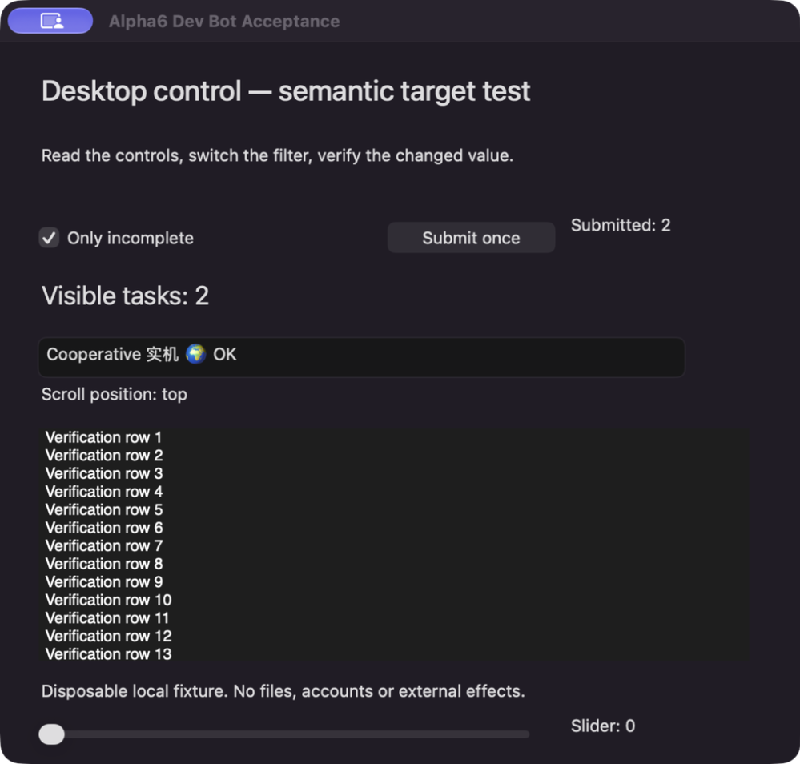

# Desktop World alpha.6 Dev Bot acceptance — 2026-10-04

Real model-driven Computer Use through **Caelis Bot Dev.app**, launched using
`script/build_and_run.sh --restart` with an isolated `CAELIS_BOT_DATA_DIR`.
Caelis v0.66.0 (`ce8a44f`) supplied the resident Runtime, with the existing
`deepseek/deepseek-flash` model. The actual Bot loaded the bundled guides and
called the four resident desktop tools; no worker, browser DOM driver, shell or
alternate writer performed its actions. Test preparation and independent
readback are separate from the Bot's operations.

Environment: macOS 27.0.1 / 26A434, arm64. Published module/helper alpha.6,
`887b863809f2ba532675668e37e91bde4dac758d`. Development signing is Apple Development
with hardened runtime; this is not notarized public-release evidence.

## Native outcomes

| Scenario | Original request / proof | Result |
| --- | --- | --- |
| Semantic checkbox, Unicode value, one submission | `alpha6-semantic-once` | Three semantic steps; checked=true and exact Chinese/emoji value verified; Submitted: 1 independently read |
| Click, select all, Unicode keyboard text, submit in one plan | `alpha6-cooperative-once` | Three foreground steps + semantic submit; 408ms, restored; exact text and Submitted: 2 independently read |
| Background window-content capture | `capture.json`, `window-content.png` | One 999×954 PNG, 208603 bytes; target-local transform, no desktop mapping; confirmed checkbox, Unicode and Submitted: 2 |
| Expanded/selected true then false | `alpha6-states-true`, `alpha6-states-false` | Four verified semantic writes; fixture setter log agrees |
| Repeat explicit false | `alpha6-states-noop` | Two verified `not_applicable` steps; setter log has no duplicate changes |
| Bounded outline output pages | `continuations.json` | 3-object / 3000-byte budget returns one projected object per page; exact continuation query restored |
| Native frontier continuation, zero matches | `continuations.json` | Visited nodes 8→16; both zero-match pages incomplete, continuation retained, second dirty; Bot reported unknown |
| Chrome dedicated tab selection + navigation | `alpha6-chrome-activate`, `alpha6-chrome-navigation` | Observed tab invoke, fresh controls, one 4-step physical plan; 451ms, restored; URL/title independently checked; existing tabs retained |
| Chrome scroll-into-view | `alpha6-chrome-reveal` | Supported visible link already onscreen; verified semantic no-op, no link activation |
| Delivered prefix + skipped suffix | `alpha6-partial-probe`, `fixture-result.json` | `set_value` delivered, intentional predicate timeout; submit skipped, counter stays 2; no replay |
| Original receipt in next turn | `recovery.json` | Exactly one status tool in that turn; same run/outcome/step facts, no observation/grant/input |
| Final behavior build `3588a15`: false checkbox + keyboard text + one submit | `alpha6-final-build-once`, `final-build-result.json`, `cleanup-recovery.json` | All five steps delivered; false verified; independent native AX and fixture log confirm exact Unicode text / Visible tasks: 3 / Submitted: 3. Cleanup was **not confirmed**: 397ms, restoration failed, outcome unknown, seat fenced. Bot queried only the original receipt and did not replay or restart |

`receipts.json` contains only curated original desktop action arguments/receipts;
`recovery.json` contains the same-turn and next-turn status results. These native
identities are synthetic evidence, not user-facing navigation. Raw Runtime
bindings, conversations, private windows/tabs and credentials are excluded.
The image is the actual Desktop World window-content tool image seen by the Bot.
The earlier counter-2 files record their point in time; `final-build-result.json`
records the final counter-3 readback. Commit `77437cf` added tests and evidence
after `3588a15`, without changing that qualified runtime or its skills.

The 2026-10-05 review follow-up narrows the validation-recovery guide: only an
unrecorded local preflight rejection permits corrected arguments under the old
ID; a helper rejection keeps the old ID/body immutable. A corrected plan needs
a new ID only after whole-plan rejection with no input is confirmed. Separate
protocol regressions use the published SDK/validator and an independent fixture
event log; the actual packaged helper also rejects duplicate step IDs and keeps
the original rejection recoverable. These checks grant no native application and
send no UI input. Controller/request recording is unchanged; the Computer Use
outcomes above remain evidence from their original run.



## Efficiency and limits

Four desktop tools and ten resident tools remain. Catalog JSON is 33384 bytes
(the internal legacy comparison is 39410 bytes); these are bytes, not tokens.
Observation defaults are 32 objects / 8KiB, without eager values/states/capabilities.
The observation guide is 50 lines, routing input/images/recovery on demand.

The semantic task used 5 inspections, 1 grant and 1 action; the cooperative task
used 4 inspections, 2 grant attempts and 1 action (the first grant was refused
before input because only the window had been observed that turn). The image
scenario used 3 inspections, including capture, and 1 grant. The Chrome scenario
needed 18 discovery inspections in its first turn plus 7 inspections, 1 grant
and 3 actions after task clarification. This is not an end-to-end speed/token
benchmark. Guidance now explicitly requires the current-turn application object,
window-scoped tab discovery and routine activation of the requested observed tab.
No model token/latency saving is claimed.

Native receipt restoration succeeded in two physical plans and failed in the
final-build plan. The native helper could not confirm restoring the previous
window/focused element; it fenced input, preserved all delivered steps, and the
Bot reported uncertainty without repeating them. The receipt does not identify
which restoration check failed, so no precise root cause or restoration
reliability claim is made. Human app-switch interruption, same-app competing
input, actual offscreen scrolling, mixed checkbox, IME/multiple displays/locked
screen, macOS 14 and amd64 remain unqualified here. Contract/transport tests cover invalid plans, independent
revocation, unknown recovery, oversized receipts, image gating/geometry and
continuation turn isolation. No Windows Bot adapter or new release is delivered.

## Reproduction

Use an absolute private profile directory (0700) and configure a connected model
through Dev Bot; do not copy daily conversations or log credentials. Build with
`make build`, then launch via `CAELIS_BOT_DATA_DIR=/absolute/private/profile
./script/build_and_run.sh --restart`.

Launch the existing checkbox/text fixture:

```sh
BOT_DESKTOP_FIXTURE_TITLE='Alpha6 Dev Bot Acceptance' \
BOT_DESKTOP_FIXTURE_LOG="$PWD/.cache/alpha6-result.json" \
./script/build_and_run.sh --desktop-control-preview
```

Launch the independent state provider fixture:

```sh
BOT_DESKTOP_FIXTURE_ALPHA6=1 BOT_DESKTOP_FIXTURE_TITLE='Alpha6 Semantic States' \
BOT_DESKTOP_FIXTURE_LOG="$PWD/.cache/alpha6-events.jsonl" \
./script/build_and_run.sh --desktop-control-preview
```

Ask Dev Bot to use the exact scenarios/desired values in `receipts.json`, observing
fresh Refs and authorizing each app in the current turn. Verify fixture output
independently; do not submit old action IDs in a fresh helper to recover them.
For native scan continuation use the first 8-node query in `continuations.json`
with the newly observed window Ref, then the returned continuation only.

Validation: `make check`, `make smoke`, `make build`; affected Go race suites;
installed Codex 0.158.0 progressive skill fixture; external Caelis NativeHost and
GuardianHost integration; actual packaged dtw handshake/read/refusal/recovery.
Both Runtime skill fixtures load the conditional desktop guides and preserve
resident/Worker isolation. Check/build/fixtures are distinct from the real model
acceptance above and from published-artifact acceptance.
