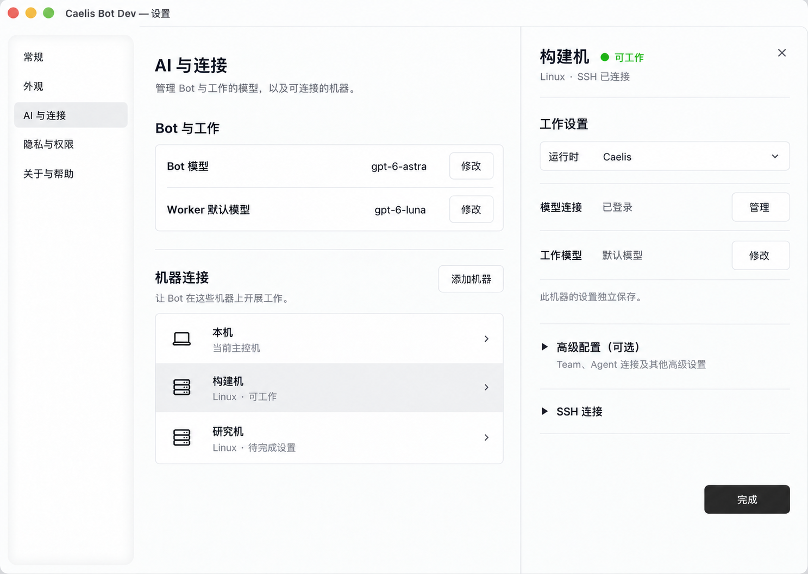

# 远端机器首版落地方案

状态：首版代码已实现；Fedora 真实工作链路通过，外部终端窗口视觉验收仍有工具访问限制。更新日期：2026-10-03。

首版让用户连接一台 Linux 机器，为这台机器完成必要的模型登录与工作设置，然后由本机 Bot 委派工作。远端运行完整 Codex 或 Caelis Runtime。用户点击脚底 Dock 的任务卡片，在自己偏好的外部终端中，通过 SSH 打开该任务的原生 TUI。

Bot APP 仍在 macOS 主控机上保持同一个长期身份。Linux 支持限于远端 Runtime 与连接辅助程序。

## 确定的最小范围

| 范围 | 首版行为 |
| --- | --- |
| 机器连接 | 可直接填写地址、端口、用户名和认证信息；支持密码、私钥及其口令、ssh-agent、主机指纹确认。既有 SSH 别名只是便捷入口，不要求预先配置别名。 |
| 工作 Runtime | 每台机器选择并配置自己的 Codex 或 Caelis；检测远端程序与基础工作能力，缺失时提供安装指引和打开远端终端的入口。 |
| 模型与登录 | 用户逐台配置；逐台在远端 TUI 完成登录，Codex 可使用设备码；APP 选择并读回工作模型，允许有效原生默认模型。 |
| Caelis 高级配置 | Team 是可选增强，收进高级配置，复用现有编辑能力。其他首版无法覆盖的 OAuth、ACP 或高级设置提供 TUI 引导占位。 |
| 远端工作 | Bot 使用明确的目标机器创建、读取、续接和停止真实 Worker，结果回到原有对话。 |
| 脚底 Dock | 延续现有卡片、点击、终端复用、窗口收起、锁定、移除及拖动行为；远端只改变终端连接方式。 |

配置复制、本机设置填充、批量应用、配置同步、凭据复制、Bot 迁移和文件自动同步均不进入首版。复杂 SSH 脚本钩子与连接拓扑不扩展为新的配置系统。

首版只验收使用当前版本新连接的节点；此前开发版本遗留的远端 owner 和节点配置兼容性不在本轮范围内。

## 配置与可工作判定

- Codex 保留 Bot 驱动模型和 Worker 默认模型两项。常驻 Bot 使用主控机上的 Bot 模型；远端任务使用该机的 Worker 默认模型，不在远端再激活一个常驻 Bot。
- Caelis 基础工作只需要可用的模型连接与默认工作能力。Team 在该 Runtime 的高级配置中独立管理，不与 Codex 统一。
- 每台机器的配置和登录凭据保存在目标机器自己的原生环境中。APP 保存机器连接信息及必要的状态，不迁移模型账号凭据。
- “可工作”依据 SSH 连接、选定 Runtime、有效认证、可用模型及原生 Worker 接入能力判定。
- **没有自定义 Team、没有配置可选 Agent 或没有完成可选高级流程，不得因此把机器标成不可工作。** 用户主动选择的特殊角色或 Agent 不可用时，仅阻止使用该能力，基础默认 Worker 仍按其真实能力工作。
- Team 配置读取或展示失败时，在高级配置中局部提示；基础工作是否可用仍由基础 Runtime 的真实状态判定。
- 如果用户选择的默认模型依赖某个 Agent，该 Agent 的必要安装和认证属于基础条件；“Team 可选”不能代替实际需要的模型认证。

工作仍从原有对话发起，例如“在构建机上检查这个项目”。首版以用户明确的机器意图选择远端，未指定时默认本机；续接沿用原任务所属机器，不新增机器切换导航或自动负载调度。

## 用户引导

### 连接机器

设置分成“AI 模型”“连接与账号”“远程机器”三个一级入口，分别承担本机模型选择、本机工作工具与账号/Agent/可选 Team 管理、SSH 机器管理。“远程机器”展示机器列表及“添加机器”。连接编辑先选择复用已有 SSH 配置或新建连接：前者搜索并选择本机 Host 别名，复用用户名、端口、密钥和支持的跳板机；后者先选择认证方式，再填写地址、用户名与对应凭据。名称可选，端口默认 22，私钥口令在需要时出现。

首次连接确认主机指纹，地址不可达、认证失败、主机身份变化使用明确提示。保存密码或私钥口令由用户选择，凭据引用由原生层管理。连接管理与任务终端复用同一份 SSH 连接信息。

宽窗口使用已选定的右侧编辑区；空间不足时使用居中弹窗。两种布局共用同一份表单和操作状态，调整窗口大小不丢失输入，也不重复提交连接请求。

### 完成工作设置

SSH 成功后进入这台机器的工作设置：

1. 检测并选择 Codex 或 Caelis；只有一个可用 Runtime 时直接采用检测结果。
2. 展示当前登录状态，打开这台机器的原生 TUI 完成认证。Codex 引导可在远端执行设备码登录，再按原生链接在浏览器授权；APP 不复制登录凭据。
3. 选择或保留有效默认工作模型，保存后读回确认。
4. 基础条件满足即显示“可工作”，用户可以直接结束设置。

模型参数使用统一的紧凑弹层：点击模型打开独立的可搜索列表，Effort 使用原生能力允许的离散滑块，支持 Fast 时显示闪电开关。Bot、工作模型与 Team 角色保持同一套交互。默认项尽量展示 Runtime 当前配置的实际模型；无法读取时仅展示“默认”，不把推荐模型当作实际默认值。工作终端偏好位于“常规”。

每一步只显示当前需要完成的事项。“稍后设置”保存机器连接并保留待完成步骤；再次打开从当前原生状态继续，不重新走已完成的步骤。

### 高级配置与 TUI 占位

Caelis 的“高级配置（可选）”默认折叠。Team 编辑在展开后出现，沿用已有组件及 Runtime 自己的角色和模型能力。

首版无法在 APP 内完成的设置统一使用以下引导：

> 此项暂时需要在这台机器的 Caelis TUI 中完成。

提供“打开远端 TUI”和“重新检查”两项操作。TUI 打开到同一机器、同一原生配置环境；用户返回后读取最新状态。高级配置占位不作为基础工作引导的必经步骤。

机器列表使用“待完成设置”“可工作”“连接不可用”等简短状态；具体原因和下一步放在机器详情中。模型、权限、连接和安装错误明确区分，避免反复显示笼统的“连接失败”。

## Dock 与终端连接

远端卡片沿用本机行为，可以用简短机器名辅助识别。点击卡片后打开用户偏好的外部终端，并通过 SSH 分配 PTY，在远端执行原生任务观察命令。

| Runtime | 原生路径 | 绑定要求 |
| --- | --- | --- |
| Caelis | `caelis attach …` | 原任务的 Host、Session、Store 和目标机器上的用户凭据。 |
| Codex | `codex --remote <endpoint> resume <thread>` | 原任务的 App Server、Thread、工作目录和原生配置环境。 |

这些是开发侧路径，产品界面不要求用户填写或理解命令、端点、原生 ID 和目录。

APP 从原任务所属节点解析可验证的 attach 信息。远端辅助程序使用固定操作和原任务绑定，在目标机器上解析程序、端点及凭据引用；本机终端启动器只负责 SSH 与现有窗口管理。不得把远端目录当成本机目录使用，也不得用一次新的模型请求模拟观察原任务。

同一任务复用原有专属终端实例。关闭终端或 SSH 观察连接只结束观察；Worker 的 Runtime owner 独立运行。断连后再次点击同一卡片，重新连接原任务。无法确认原绑定时给出原有任务打开错误，保留任务，不创建替代任务。

不增加远端任务详情面板、进度弹窗、重连专用按钮、迁移或重跑操作。锁定、移除、窗口关闭和任务停止的语义沿用现有产品合同。

## 已落地的实现

- `internal/machines` 管理 SSH 连接、指纹、凭据引用、机器身份、任务路由和状态观察；不会在本机求值远端工作目录。
- `cmd/caelis-remote` 与 `internal/remotework` 提供 Linux 无界面辅助程序。连接时明确下发 APP 自带的校验成品，不安装或复制 Codex/Caelis。
- 两种 Runtime 的私有 `WorkOwner` 沿用原生 Worker 接口；远端拥有完整原生推理能力，没有另一个常驻 Bot，也没有 Bot 工具。
- 任务先持久化原机器再派发。Codex 原 App Server 不可达时拒绝启动替代服务，Caelis 保留原生 Session 与用户凭据引用。
- APP 侧模型设置与英文 Bot skill 已适配明确机器选择、机器独立配置、原任务续接及未知状态恢复。
- 机器连接支持直接地址、密码、私钥/口令和 agent；既有 SSH 别名和单个已配置 ProxyJump 可复用。自定义 ProxyCommand 和多跳配置明确提示首版不支持。

实现从当前 main 接回最小功能，没有恢复备份分支的整套节点导航。备份分支只选择性复用了 Linux 原生进程与工具进程归属处理。

## 发布验收

| 验收项 | 通过条件 |
| --- | --- |
| SSH 连接 | 无预配置别名也可连接；密码、私钥、口令和 ssh-agent 路径可用；主机指纹及错误提示明确。 |
| 独立设置 | 两台机器可使用不同登录与模型；修改一台不会改动另一台或主控。 |
| Caelis 基础工作 | 未配置自定义 Team 时，真实 Worker 可启动并完成任务，机器显示可工作。 |
| 高级占位 | 未覆盖的高级流程可打开正确机器的 TUI；完成后读回最新状态；可选流程不阻断基础工作。 |
| 原任务观察 | 两种 Runtime 各完成一次真实 Linux 任务；Dock 的 SSH TUI 打开同一原生任务，Bot 收到其结果。 |
| 生命周期 | 终端复用、收起、关闭、拖动、锁定和移除保持本机行为；SSH 断开不停止 Worker；重连不重复派任务；显式停止以原生回执为准。 |
| UI | 宽窗口、窄窗口、中文和英文逐页检查；草稿、错误、登录等待、稍后继续及高级配置折叠行为正确。 |

当前证据见[首版验收记录](evidence/remote-machines-v1/acceptance.md)，复现命令见[开发与验证](development.md#remote-machine-acceptance)。Ghostty 生产观察连接已通过两轮打开、收起、恢复、关闭和重开，原任务绑定保留；终端内部画面受工具访问限制，仍需人工视觉补验。不能把 SSH PTY 通过或窗口 fixture 当作完整窗口视觉验收。

## 设置草稿

草稿保留已选定的右侧编辑布局。它展示基础模型已可用、没有自定义 Team 的 Caelis 机器处于“可工作”，Team 仅出现在默认折叠的高级配置中。图片是设计参考，字段语义以本文为准。

